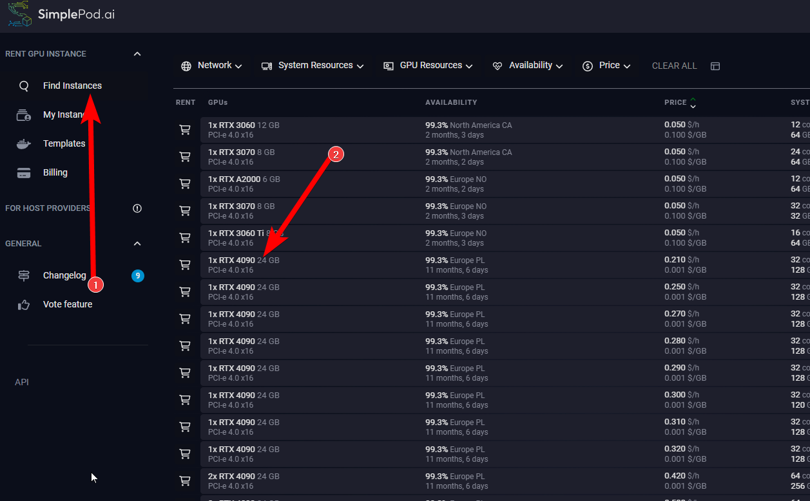
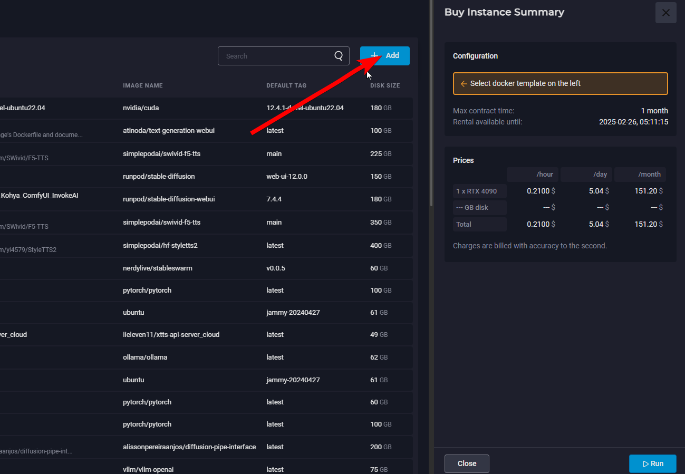
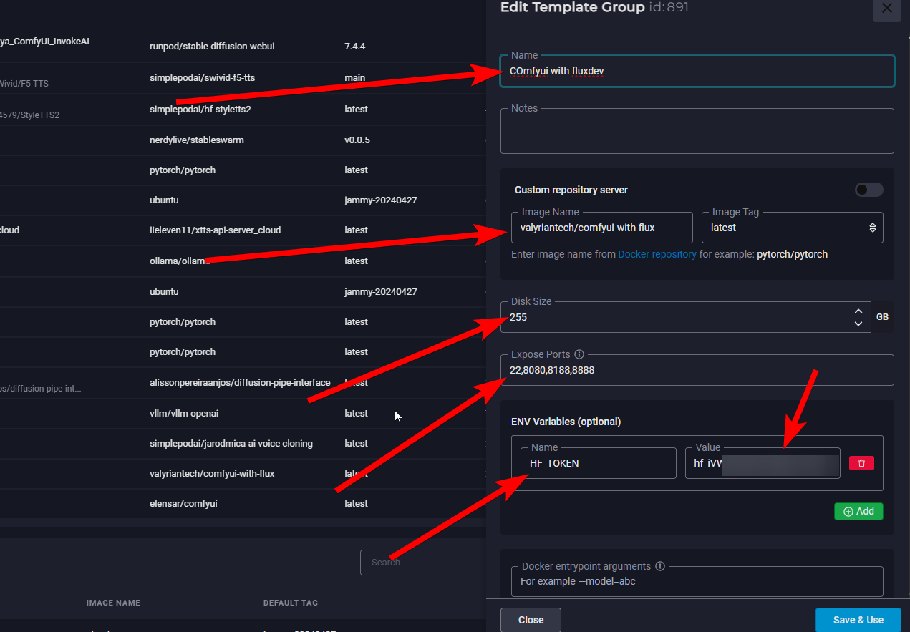
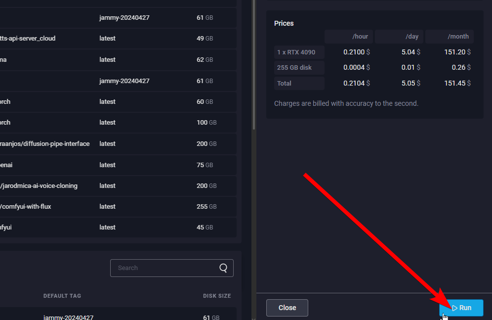
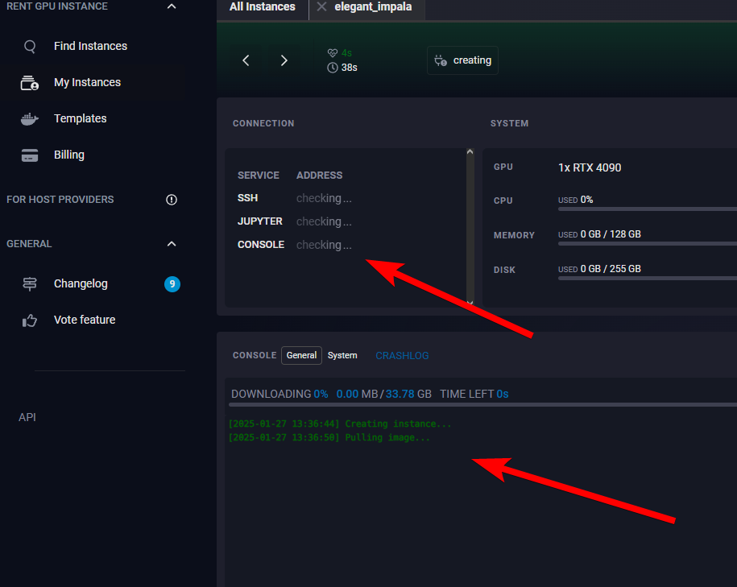
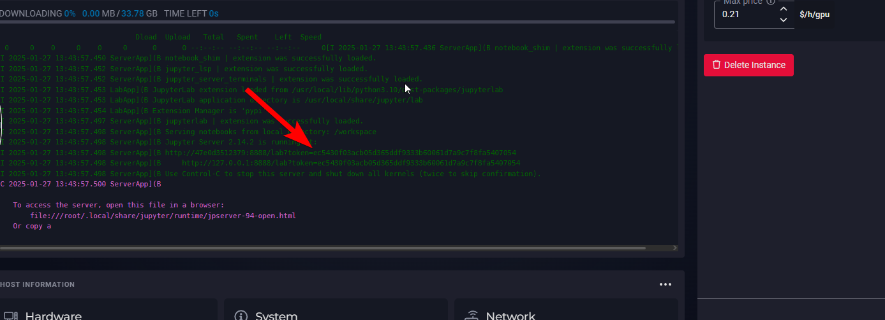

# SimplePod_ComfyUI
Instructions to get a simplepod.ai comfyui instance setup 

<h3 class="wp-block-heading"><strong>Create Your Own Image Generation ComfyUI Instance!</strong></h3>

Welcome to this beginner-friendly tutorial on creating a ComfyUI GPU instance on the Simplepod.AI Cloud Compute Servers. In this guide, we will walk you through the process of setting up a simplepod.ai cloud instance to run inference or train image models within ComfyUI. Image generation technology has advanced significantly, allowing us to create highly interesting and creative images and videos.

<h3 class="wp-block-heading">What You Will Learn</h3>

<ul class="wp-block-list">

<li><strong>Understanding ComfyUI Front end</strong>: ComfyUI is a free, open-source program that lets users create AI-generated images from text prompts. It uses a node-based interface to create workflows for image generation. </li>

</ul>

<ul class="wp-block-list"><!-- wp:list-item {"style":{"spacing":{"padding":{"top":"0","bottom":"0","left":"0","right":"0"}},"border":{"radius":"0px","width":"0px","style":"none"}}} -->

<li style="border-style:none;border-width:0px;border-radius:0px;padding-top:0;padding-right:0;padding-bottom:0;padding-left:0"><strong>Setting Up a Cloud Instance</strong>: We will guide you through the steps to set up a cloud environment where you can run the necessary tools and scripts. This setup is crucial for handling the computational requirements of of image generation and training.</li>

</ul>

<ul class="wp-block-list">

</ul>

<li><strong>Cloud vs. Local Setup</strong>: While this tutorial focuses on using a cloud instance, you can also run the tools locally if your hardware supports it. Each setup has its pros and cons.</li>

</ul>

<ul class="wp-block-list">

<h3 class="wp-block-heading">Getting Started</h3>

Before diving into the technical details, make sure you have the following prerequisites:

<ul class="wp-block-list">
<li>While not required, a basic understanding of Python and cloud computing would be very helpful. I will try to guide you as best I can but the process can be nuanced.</li>

<li>Access to Simplepod.AI account </li>

</ul>

Step 1. Login to Simplepod.ai and click "find instances".

    

Step 2. Select a single RTX 4090. Note: for now stick with a single GPU. Multi GPU training is called distributed data processing or D.D.P for short. This can become extremely complex and in some cases is not supported. You can circle back to learn D.D.P at a later time but ultimately is beyond the scope of this tutorial.

    

Step 3. The docker templates page will pop open and from here click on the add button". 

    

Step 4. This will open up a side panel to your right. Name it something, then where it says "Custom repository server Image Name, put this: valyriantech/comfyui-with-flux. Disk size can be whatever you want, expose ports are 22,8080,8188,8888 and the ENV variables are Name:HF_TOKEN and its value would be what you need to get from huggingface.co after making an account and going into your profile to make a token.

    

Step 5. Now you can click save template then run.

    

You will get a quick popup. Click it to go to your instance. If you're not fast enough you can click "My Instances" on the left side panel to get to the same place. 

    

Now you have to wait for the instance to load the docker image. It will look something like this:

<figure class="wp-block-image size-large"></figure>

Step 6. When the instance has loaded up you'll start to see buttons appear. These are different ways to access the data and scripts within the instance. In this case, lets open the WebUI by clicking on the Port 8080 button. You can also get into the jupyter notebook or use SSH if you wish 

You are now within the instance and can begin doing your thing as you normally would! 

 and in two videos he made: <a href="https://youtu.be/WWhNqJEmF9M?si=RhUZhYersAvSZ4wf">https://youtu.be/WWhNqJEmF9M?si=RhUZhYersAvSZ4wf</a> <a href="https://www.youtube.com/watch?v=7tpWH8\_S8es&amp;t=504s">https://www.youtube.com/watch?v=7tpWH8\_S8es&amp;t=504s</a> 

]]></content:encoded>
